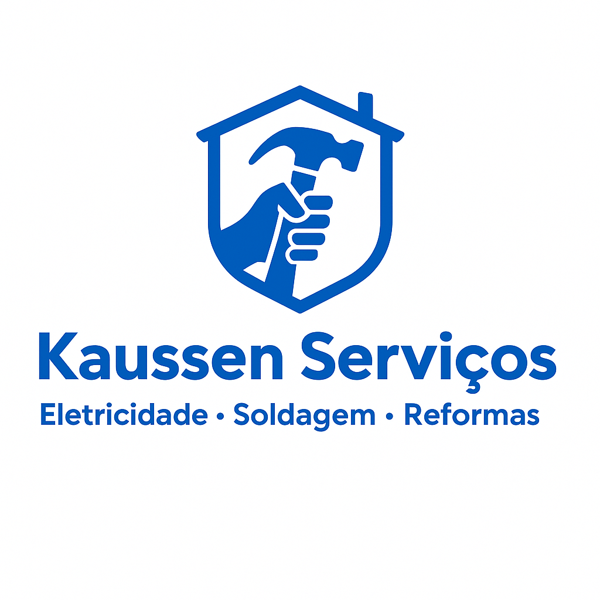

<!DOCTYPE html>
<html lang="pt-BR">
<head>
  <meta charset="UTF-8">
  <meta name="viewport" content="width=device-width, initial-scale=1.0">
  <title>Kaussen Serviços – Em construção</title>
  
  <!-- Font Awesome für WhatsApp Icon -->
  
</head>
<body>
  
  <h1>Website em construção</h1>
  
Estamos trabalhando para oferecer algo especial em breve.

  <a class="whatsapp-button" href="https://wa.me/5511941188664" target="_blank" aria-label="Fale conosco no WhatsApp">
    <i class="fab fa-whatsapp"></i>
  </a>
</body>
</html>
